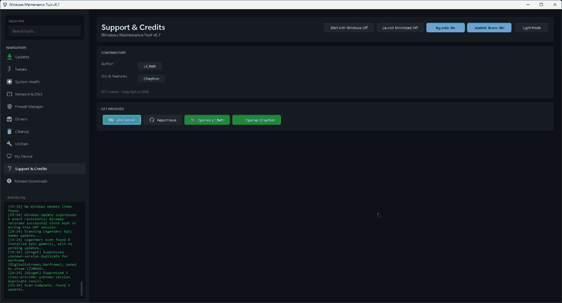

# Windows Maintenance Tool


Windows Maintenance Tool (WMT) is an all-in-one Windows 10/11 maintenance GUI for updates, repairs, cleanup, drivers, networking, firewall management, system tuning, compression, software/game libraries, and diagnostics. It brings tasks that normally live across Settings, Control Panel, PowerShell, Task Scheduler, Registry Editor, Device Manager, and separate utilities into one interface.

WMT is designed for technicians, power users, and everyday users who want visible status, searchable tools, confirmation prompts, backups where appropriate, and background work that avoids freezing the WPF interface.

<details>
<summary><b>False positive / antivirus reporting links</b></summary>

If your antivirus reports WMT as a PUP or false positive, submit the file to the antivirus vendor for review and whitelist your trusted local copy if appropriate. WMT is open source, and antivirus false positives should be reported to the antivirus vendor rather than opened as WMT bug reports.

| Antivirus vendor | Submission link or email | Notes |
| :--- | :--- | :--- |
| **Avast** | [Avast False Positive Form](https://www.avast.com/en-us/false-positive-file-form.php) | Web form for file or URL submission. |
| **AVG** | [AVG False Positive Form](https://www.avg.com/en-us/false-positive-file-form) | AVG and Avast share engines, but use their respective forms. |
| **Avira** | [Avira Analysis Submit](https://analysis.avira.com/en/submit) | Requires an account/login. |
| **Bitdefender** | [Bitdefender Submission Portal](https://www.bitdefender.com/submit/) | You can also contact Bitdefender sample submission support. |
| **ClamAV** | [ClamAV False Positives](http://www.clamav.net/reports/fp) | Open-source engine used by many secondary providers. |
| **ESET** | `samples@eset.com` | Follow ESET's sample-submission instructions. |
| **F-Secure** | [F-Secure Sample Submit](https://www.f-secure.com/en/web/labs_global/submit-a-sample) | Include details that the detection is believed to be a false positive. |
| **Kaspersky** | [Kaspersky OpenTip](https://opentip.kaspersky.com/) | Analyze the file and submit it for review. |
| **Malwarebytes** | [Malwarebytes Forums](https://forums.malwarebytes.com/forum/122-false-positives/) | False-positive reports are handled through their forums. |
| **McAfee** | `virus_research@mcafee.com` | Follow McAfee's sample-submission instructions. |
| **Microsoft Defender** | [Microsoft Security Intelligence](https://www.microsoft.com/en-us/wdsi/filesubmission) | Select the appropriate developer/software submission option. |
| **Norton / Symantec** | [Symantec Submit Form](https://symsubmit.symantec.com/) | Choose the incorrect-detection workflow. |
| **Sophos** | [Sophos Sample Submission](https://secure2.sophos.com/en-us/support/submit-a-sample.aspx) | Explain that you believe the file is a false positive. |
| **Trend Micro** | [Detection Re-evaluation](https://www.trendmicro.com/en_us/about/legal/detection-reevaluation.html) | Provide the requested file/hash details. |

VirusTotal maintains a broader vendor contact directory here: https://docs.virustotal.com/docs/false-positive-contacts
</details>

## Highlights

- Modern searchable GUI with persistent dark/light themes, tray support, start-with-Windows, and start-minimized controls.
- Updates panel covering Windows/package managers, language ecosystems, PowerShell tooling, Steam, Epic/Legendary, and GOG/GOGDL.
- Per-provider update, package-search, library-search, and metadata controls where supported.
- Custom per-package PowerShell updater commands with placeholders for package metadata.
- Unified game/software library with Steam, Epic/Legendary, GOG, and package-provider integration.
- Rebuilt Drivers page that inventories third-party Driver Store packages and classifies in-use, old/superseded, unattached, and inactive packages.
- Advanced cleanup with internal rules, Winapp2, Winapp3, BleachBit CleanerML, preview/analyze mode, configurable cache/update refresh intervals, and optional automatic cleanup.
- Compact Compression utility for folders and drives with persistent tracking, skip lists, change-aware recompression, and scheduled auto-recompression that can run without the WMT window being open.
- Firewall Manager with background rule loading, cached details, and fast protocol/port preloading through the Windows Firewall COM/.NET path with fallback behavior.
- Background runspace/process infrastructure for long-running scans, DISM, networking, service, driver, package, and other operations so the GUI remains responsive.
- Safety-focused registry cleanup, backups/revert paths, review-only findings, confirmation prompts, and detailed activity logging.
- PS2EXE release builds plus validation/release workflows, with optional release submission paths for WinGet and Chocolatey.

## Screenshot



## What's new in v6.7

Recent v6.7 work includes substantial performance, automation, and maintenance improvements:

- Added the **Compact Compression** tracker, tracked folder/drive history, automatic recompression, custom schedules, change detection, and optional skip lists for already-compressed file formats.
- Added configurable cleaner **local cache refresh**, **upstream list update check**, and **automatic cleaning** intervals. Automatic cleaning uses the saved cleaner selections and runs in a separate hidden worker process while WMT is open or in the tray.
- Added **Show Enabled** filtering and additional race/coordination hardening to the advanced cleaner UI/background workers.
- Added fast firewall protocol/port metadata preloading through `HNetCfg.FwPolicy2`, while retaining lazy/fallback detail loading.
- Expanded and themed the system-tray context menu with direct shortcuts to Updates, System Health, Cleanup, Drivers, Utilities, and theme switching.
- Added **custom updater commands** for individual pending package rows, including `{id}`, `{name}`, `{source}`, `{version}`, and `{available}` placeholders.
- Added portable **Legendary** and **GOGDL** provider-binary update checks to the normal Updates flow.
- Hardened Steam ownership filtering so Steam-installed games are less likely to appear as duplicate/unknown-version Winget updates.
- Reworked shared background execution, process running, polling, Steam parsing, and driver operations to move more blocking work off the WPF thread.
- Added UTF-8 Steam manifest handling so registered/trademark/accented titles render correctly.
- Added PowerShell syntax validation workflow support and release-workflow improvements.
- Added tweak configuration **Export JSON / Import JSON** support.
- Expanded registry-cleaner handling for BAM/DAM and `PendingFileRenameOperations`, including safer pair-preserving rewrites and review-only handling where automatic changes are unsafe.

## Core Features

### Updates and Software

- Scan for updates from Winget, Microsoft Store / Store CLI, Chocolatey, pip, npm, pnpm, Scoop, Ruby Gems, Cargo, .NET global tools, PowerShell modules, Composer, Steam manifests, Legendary, GOGDL, and other supported providers.
- Update packages one at a time with visible status/progress, or use supported batch/update-all flows.
- Search packages by name and inspect provider results as individual providers finish instead of waiting for every provider.
- Control update scans, package search, game/library search, and metadata behavior independently for supported providers.
- Ignore selected Winget packages and optionally include unknown-version Winget entries for manual review.
- Attach a custom PowerShell update command to a package when you want WMT to run your command instead of the provider's normal update command.
- Use placeholders in custom commands: `{id}`, `{name}`, `{source}`, `{version}`, and `{available}`.
- View Winget manifest details from package rows; Chocolatey package/community information is also integrated where available.
- Delegates Steam game updates through Steam after local manifest comparison.
- Updates Epic games through Legendary when authenticated and installed GOG games through GOGDL/Heroic authentication.
- Checks WMT-managed portable Legendary/GOGDL binaries for newer releases and can surface provider updates as normal update rows.
- Background update scanning can run from tray mode; **BG Jobs** and **Update Scans** are independently toggleable.
- Shared provider process/runspace infrastructure includes timeout/error handling so a slow provider is less likely to block the entire Updates page.

### Game & Software Library

- View installed Steam, Epic/Legendary, and GOG games in one combined library.
- Search/filter the library by title/provider and sort list columns.
- Launch installed titles and use supported install/uninstall actions.
- Open supported Steam/Epic/GOG store pages directly from library/provider rows.
- Include owned Legendary/GOG titles in package search when library searching is enabled.
- Optionally hide Unreal Engine / Fab marketplace assets from the visible library without disabling their update checks.
- Uses cached provider/library metadata and background refreshes to improve repeat-load performance.

### System Health

- Run `sfc /scannow`.
- Run DISM CheckHealth and RestoreHealth operations.
- Run Quick Fix/common repair routines.
- Check Windows Recovery Environment (WinRE) state with concise and technical views.
- Run CHKDSK tools.
- Repair Windows Update components and reset update services.
- Long-running repair operations use background workers where practical to reduce WPF-thread stalls.

### My Device

- View Windows, CPU, RAM, GPU, motherboard, storage, network, battery, and power details.
- View drive health details and run drive benchmarks.
- Export the current My Device summary.
- Use quick actions for driver, cleanup, storage, DNS, update, and health functions.
- Clean RAM and manage memory-compression related settings.
- Run SSD TRIM/disk optimization logic while avoiding TRIM actions on HDDs.
- Open Disk Management, Windows Update, and related Windows tools.

### Tweaks

- State-aware toggle buttons for supported settings, with consistent active/inactive visual states.
- Export the current tweak configuration to JSON and import a previous export, applying only settings that differ.
- Performance service optimization/revert controls.
- Hibernation, SysMain, memory compression, power plan, Windows Update policy, and optional Windows feature controls.
- Taskbar alignment, search, widgets, Task View, Chat, combine behavior, and related shell controls.
- Clock options including 12/24-hour format and seconds display.
- Hardware-Accelerated GPU Scheduling (HAGS).
- Explorer controls for file extensions, hidden files, full-path title bars, launch location, recent/frequent items, and related behavior.
- Mouse pointer speed/acceleration and single-click/double-click behavior.
- Context-menu tweaks including classic Windows 11 menu, Take Ownership, and PowerShell Here.
- Privacy, search, gaming, visual-effect, notification, lock-screen, AppX/bloatware, and advanced/power-user controls.
- Tweak state loading runs in the background and is scoped to the Tweaks page so loading overlays do not leak onto other tabs.

### Cleanup

- Delete temporary files, recycle-bin contents, Windows Error Reporting data, thumbnail caches, browser traces, Explorer traces, and other selected targets.
- Analyze/preview cleanup targets before deleting files, including status for protected or in-use items.
- Run advanced cleanup rules from WMT's internal cleaners, Winapp2, Winapp3, and BleachBit CleanerML.
- CleanerML support includes broader action parsing such as truncate, registry actions, SQLite vacuum, and process guarding where the source rules define them.
- Cache parsed cleaner rules for faster repeat startup and optionally skip downloads/use cached definitions.
- Configure how often WMT refreshes local parsed cleaner caches and how often it checks upstream cleaner definitions for changes.
- Configure automatic cleanup intervals using your saved cleaner selections; the cleaner work itself runs in an isolated hidden process.
- Filter the cleaner selection list, including a **Show Enabled** view for quickly reviewing active selections.
- Clear Windows Event Logs.
- Find, inspect, repair, or delete broken shortcuts.
- Registry cleaner with backups, confidence/risk metadata, richer scan coverage, Regedit context actions, and review-only handling for findings that should not be changed automatically.
- Registry cleanup includes safer BAM/DAM stale activity cleanup and pair-preserving handling of `PendingFileRenameOperations`.
- Clear Xbox credentials for login-loop fixes.
- Free local OneDrive disk space while keeping cloud copies.

### Compact Compression

- Compress a folder or a whole local NTFS drive from a dedicated GUI.
- Use standard NTFS compression and supported Compact/WOF executable compression modes.
- Persistently track previously compressed targets in `data\compact-tracker.json`.
- Enable/disable automatic recompression per tracked target.
- Schedule background recompression through Windows Task Scheduler so tracked targets can be handled even when WMT itself is not open.
- Choose preset schedules or a custom interval.
- Detect whether tracked content has changed before recompressing rather than blindly recompressing unchanged data.
- Optionally skip extensions that are commonly already-compressed/poor compression candidates, with support for custom extension skip lists.
- Keep last-run/result/status information for tracked targets and surface it in the compression UI.

### Drivers

- Inventory third-party packages staged in the Windows Driver Store.
- Show package status including **In Use**, **Old**, **Unattached**, and **Inactive** with device-usage context.
- Search/filter drivers by status, class, provider, file name, and related metadata.
- Reload/rescan the driver list with caching to avoid unnecessary repeated work.
- Export installed drivers and selected categories.
- Restore drivers from backup.
- Generate detailed driver reports.
- Remove ghost devices.
- Clean old/superseded duplicate driver packages with safety checks for unknown/in-use devices.
- Enable/disable Windows automatic driver updates and device metadata downloads.
- Open external research/update checks for selected drivers, including Microsoft Update Catalog and VirusTotal where supported by the UI.
- Driver backup/cleanup and `pnputil` operations are moved off the WPF thread where possible.

### Network and DNS

- Flush DNS and reset network settings.
- Set DNS to Cloudflare, Google, Quad9, DHCP, or custom IPv4/IPv6 servers.
- Register/remove DNS-over-HTTPS templates for custom DNS entries.
- Enable/disable DNS-over-HTTPS rules.
- View routing tables.
- Edit the hosts file and apply supported ad-block hosts lists with backup handling.

### Firewall Manager

- View, search, add, edit, enable, disable, and delete firewall rules.
- Background-load the base firewall rule list to keep navigation responsive.
- Preload protocol/port metadata using the Windows Firewall COM interface (`HNetCfg.FwPolicy2`) from background work when enabled.
- Fall back to lazy NetSecurity detail lookup when the fast path is unavailable.
- Cache selected-rule details to reduce repeated expensive queries.
- Export/import firewall policies.
- Restore firewall defaults or purge rules with confirmation.
- Background firewall preload respects the global Background Jobs setting.

### Startup & Restore Management

- Startup Manager for startup apps, scheduled tasks, context-menu entries, and services.
- Open relevant file locations, Registry paths, and Task Scheduler locations/actions where possible.
- Restore Manager for creating, deleting, restoring, enabling, and disabling restore points/system protection workflows.

### System Tray, Background Jobs, and Automation

- Optional system-tray mode keeps selected background scans/notifications active while the main window is hidden.
- Start WMT with Windows and optionally launch minimized.
- Independent **BG Jobs** and **Update Scans** toggles are exposed on Support & Credits.
- Tray menu follows the active theme and provides shortcuts to major pages plus a theme toggle and Exit.
- Update scans can run periodically while WMT remains active in the tray.
- Cleaner definition maintenance and auto-clean use separate hidden worker processes to avoid blocking the GUI.
- Compact auto-recompression uses a scheduled worker/task and does not require the main WMT window to stay open.
- Shared polling/runspace infrastructure centralizes background completion handling and reduces duplicated UI timers.

### Utilities

- Startup Manager.
- Restore Manager.
- Compact Compression manager.
- Context menu builder.
- System reports.
- Release download statistics.
- .NET roll-forward configuration.
- Group Policy Editor installer for supported Windows Home systems.
- Optional MAS activation helper with explicit user confirmation.
- Quick access to common Windows administrative tools.

## Getting Started

### Recommended Launch

Double-click:

```bat
Start_WMT_GUI.bat
```

Keep `Start_WMT_GUI.bat` and `WMT-GUI.ps1` in the same folder. The launcher validates the script and starts the GUI with the required permissions.

### EXE Build

To build a local EXE release:

```powershell
.\PS2EXE\Build-Exe.ps1 -InstallPS2EXE
```

Default output:

```text
dist\WindowsMaintenanceTool.exe
```

The EXE build uses the version from `$AppVersion` in `WMT-GUI.ps1` and requires administrator privileges at runtime.

### Manual Launch

```powershell
powershell -NoProfile -ExecutionPolicy Bypass -File "WMT-GUI.ps1"
```

## Requirements

- Windows 10 or Windows 11
- PowerShell 5.1 or later
- Administrator privileges for most maintenance actions
- Internet connection for online update checks, provider scans, downloads, metadata, and community cleaner definitions

## Output and Data Folder

WMT stores generated data next to the script in its local `data` folder.

| Output | Purpose |
| --- | --- |
| `settings.json` | Saved WMT settings and feature toggles |
| `Installed_Drivers.txt` | Driver report output |
| `Drivers_Backup_*` | Exported driver backups |
| `SystemReports_*` | System, network, and driver reports |
| `RegistryBackups` | Registry-cleaner backups |
| `hosts_backups` | Hosts-file backups |
| `winapp2.ini` / `winapp3.ini` / cleaner cache files | Advanced cleanup community rules and parsed caches |
| `bleachbit_cleanerml` / CleanerML cache files | BleachBit CleanerML definitions/cache |
| `compact-tracker.json` | Tracked Compact Compression targets, schedules, state, and results |
| Compact worker/log files | Scheduled/background recompression support |
| `legendary` / `gogdl` | WMT-managed portable game-provider tools/auth data |
| Provider/library cache files | Cached package and game-library metadata |
| Cleaner refresh/auto-clean result files | Last background cleaner maintenance/automatic-clean summaries |
| `last-crash.txt` | Last captured WMT crash/monitor diagnostic |

## Safety Notes

- Destructive actions use confirmation prompts where practical.
- Registry and hosts changes create backups where applicable.
- Many tweak groups include revert actions.
- Registry cleaner review-only rows are shown for inspection and are not fixed automatically.
- Automatic cleanup uses **saved explicit cleaner selections** rather than silently opting into first-run defaults.
- Compact auto-recompression tracks only targets you explicitly add/enable.
- Background jobs can be disabled globally; update scans also have a separate toggle.
- Start with Windows can validate/repair its saved launch path after WMT is moved.
- WMT itself does not send telemetry.
- Some functions call Windows components, package managers, GitHub/community rule sources, or third-party provider CLIs and therefore depend on those components/services being available.

## Troubleshooting

| Problem | What to try |
| --- | --- |
| App does not start | Run `Start_WMT_GUI.bat` from the same folder as `WMT-GUI.ps1`. |
| SmartScreen blocks launch | Choose **More info** and **Run anyway** only if you trust the copy you downloaded/built. |
| Admin prompt appears | Accept it if you intend to use maintenance actions that require elevation. |
| Winget scan fails | Verify App Installer/Winget is installed and internet access is working. |
| Package provider hangs/fails | Retry that provider; WMT includes timeouts but some provider CLIs still require manual intervention. |
| A Steam game appears as a Winget update | Refresh scans/library data; v6.7 includes additional Steam ownership filtering for duplicate/unknown-version rows. |
| Epic/GOG game is missing | Refresh the library and verify Legendary/GOGDL authentication, local manifests, and provider toggles. |
| Cleaner definitions look stale | Review the cleaner local-refresh/upstream-check intervals and ensure Background Jobs/downloads are enabled. |
| Automatic cleanup does not run | Confirm an auto-clean interval is set, Background Jobs are enabled, and at least one cleaner selection has been saved/enabled. |
| Compact scheduled recompression does not run | Re-save the Compact schedule and verify the generated Windows scheduled task/worker files still exist. |
| Firewall ports initially look blank | Allow the background preload to finish, or select a rule so the lazy fallback can load its details. |
| Start with Windows stops working after moving WMT | Open Support & Credits and use the startup controls so WMT can validate/repair the saved path. |
| A tweak causes issues | Use the matching revert/toggle action or import a known-good tweaks JSON export. |
| Registry cleanup finds protected/review-only entries | Inspect them; those rows are intentionally not changed automatically. |

## Development and Releases

- `.github/workflows/validate-powershell.yml` validates PowerShell syntax and can also be run manually.
- `.github/workflows/release-ps2exe.yml` builds PS2EXE releases and supports manual release controls.
- Release tooling includes optional WinGet submission and Chocolatey package publication paths when the required secrets/package entries are available.
- Long-running GUI operations are increasingly routed through shared runspace/process/polling infrastructure to keep the main WPF dispatcher responsive.

## Project Links

- [Releases](https://github.com/Chaython/Windows-Maintenance-Tool/releases)
- [Issues](https://github.com/Chaython/Windows-Maintenance-Tool/issues)
- [Pull Requests](https://github.com/Chaython/Windows-Maintenance-Tool/pulls)
- [Actions](https://github.com/Chaython/Windows-Maintenance-Tool/actions)
- [Commit history](https://github.com/Chaython/Windows-Maintenance-Tool/commits/Main)

## Credits

- Original author: [Lil_Batti / ios12checker](https://github.com/ios12checker)
- GUI, features, and current fork maintenance: [Chaython](https://github.com/Chaython)
- Upstream project: [ios12checker/Windows-Maintenance-Tool](https://github.com/ios12checker/Windows-Maintenance-Tool)

## Community

[](https://discord.gg/bCQqKHGxja)

## Contributing

Issues and pull requests are welcome. When reporting a problem, include when possible:

- Windows version
- WMT version
- Reproduction steps
- Relevant provider/tool involved
- Screenshot, copied row data, activity-log output, or error text

If WMT helps you, consider starring the repository.
